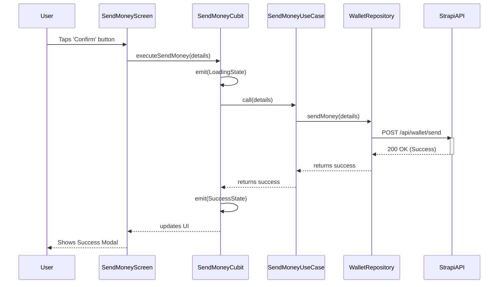

# MayaApp - A Simple Flutter E-Wallet

A 4-screen Flutter e-wallet application designed for simplicity and ease of use. It demonstrates a modern Flutter development stack including Clean Architecture, Cubit for state management, and a pre-configured Strapi backend.

---

## ✨ Features

- 👤 **User Authentication:** Secure login using an 11-digit mobile number and password.
- 💰 **Balance Viewing:** A clear home screen displaying the user's current balance, with a toggle to hide/show the amount for privacy.
- 💸 **Send Money:** A user-friendly form to send funds to another user by entering their 11-digit mobile number.
- 📜 **Transaction History:** A clean, filtered list showing all incoming (credit) and outgoing (debit) transactions for the user.
- 🎨 **Creative & Friendly UI:** Designed with high-contrast elements, large fonts, and intuitive icons, making it accessible even for elderly users.

---

## 🏗️ Architecture & Tech Stack

This project is built using **Clean Architecture** to ensure a separation of concerns, making the codebase scalable, maintainable, and testable.

- **Architecture:** Clean Architecture (Domain, Data, Presentation Layers)
- **State Management:** **Cubit** (`flutter_bloc`) for simple and predictable state management.
- **Frontend:** Flutter
- **Backend:** **Strapi v5** (Headless CMS) - _Pre-configured in the backend repository._
- **API Communication:** **Dio** for robust network requests.
- **Dependency Injection:** **`get_it`** as a service locator.
- **Testing:** **`bloc_test`** and **`mockito`** for unit testing the business logic.

---

## 📐 System Design & Architecture

### Architectural Overview

The application is built using **Clean Architecture**. This paradigm separates the code into three distinct layers, ensuring a scalable, maintainable, and testable codebase:

- **Domain Layer**: This is the core of the application. It contains the business logic, entities (e.g., `User`, `Transaction`), and abstract repository contracts. It has no dependencies on any framework or external package.

- **Data Layer**: This layer is responsible for all data operations. It implements the repository contracts defined in the Domain layer and handles the communication with the Strapi API via a `RemoteDataSource`. It's also responsible for converting API JSON responses into strongly-typed Dart objects (Models).

- **Presentation Layer**: This layer contains all UI-related components (Screens, Widgets) and the state management logic (Cubits). It depends on the Domain layer's use cases to trigger business logic and reacts to state changes emitted by the Cubits to update the UI.

**State Management**: We use **Cubit** (from the `flutter_bloc` package) for its simplicity and minimal boilerplate, making it ideal for managing the state of individual screens.

**Dependency Injection**: The **`get_it`** package is used as a Service Locator to provide dependencies (e.g., Repositories, Use Cases) throughout the app, effectively decoupling the layers.

**API Design**: The **Strapi** backend exposes a REST API. A key design choice is the use of a custom controller (`/api/wallet/send`) for the "Send Money" feature. This ensures the entire operation—debiting the sender, crediting the recipient, and creating transaction logs—is **atomic**. If any part of the process fails, the entire database transaction is rolled back, preventing data inconsistencies.

### Class Diagram (Fetch Transaction History)

This diagram shows the relationship between the major classes involved in fetching and displaying the transaction history.

```mermaid
classDiagram
    direction LR
    class TransactionHistoryScreen {
        +build()
        +BlocBuilder()
    }
    class TransactionsCubit {
        +fetchTransactions()
        +List~Transaction~
    }
    class GetTransactions {
        <<UseCase>>
        +call()
    }
    class WalletRepository {
        <<Interface>>
        +getTransactions()
    }
    class WalletRepositoryImpl {
        +getTransactions()
    }
    class RemoteDataSource {
        <<Interface>>
        +getTransactions()
    }
    class TransactionModel {
        +fromJson()
    }

    subgraph Presentation Layer
        TransactionHistoryScreen
        TransactionsCubit
    end

    subgraph Domain Layer
        GetTransactions
        WalletRepository
    end

    subgraph Data Layer
        WalletRepositoryImpl
        RemoteDataSource
        TransactionModel
    end

    TransactionHistoryScreen ..> TransactionsCubit : "listens to"
    TransactionsCubit ..> GetTransactions : "uses"
    GetTransactions ..> WalletRepository : "depends on"
    WalletRepository <|-- WalletRepositoryImpl : "implements"
    WalletRepositoryImpl ..> RemoteDataSource : "uses"
    RemoteDataSource ..> TransactionModel : "creates"
```



### Sequence Diagram (Send Money Flow)

This diagram illustrates the sequence of interactions between components when a user performs the "Send Money" action.



---

## 🚀 Getting Started

Follow these steps to get the application running on your local machine. This involves setting up both the backend and the frontend.

### Prerequisites

- Flutter SDK (version 3.x or later)
- Node.js (v18 or later) & npm
- An IDE like VS Code or Android Studio
- An Android Emulator or a physical device (iOS or Android)

### 1. Backend Setup (Strapi)

The backend is a pre-configured Strapi project provided in a separate repository.

1.  **Clone the Backend Repository:**

    ```bash
    # Replace the URL with your actual backend repository URL
    git clone https://github.com/ranieljumz/Maya_Technical_Exam.git
    cd backend
    ```

2.  **Install Dependencies:**

    ```bash
    npm install
    ```

3.  **Run the Backend in Development Mode:** This command will build the admin UI and start the server.

    ```bash
    npm run develop
    ```

4.  **Create Your First Admin User:** The first time you run the backend, it will open `http://localhost:1337/admin` in your browser. Follow the prompts to create your admin account.

5.  **Verify API Permissions:** This step is crucial. Even with a cloned repo, you should verify that the correct permissions are enabled.

    - In the Strapi Admin Panel, navigate to **Settings** -> **Roles** (under Users & Permissions Plugin).
    - Click on the **Authenticated** role.
    - Scroll down to **Permissions** and ensure the following actions are checked:

      - **Transaction**

        - [x] `create` - (Allows the backend to create transaction logs)
        - [x] `find` - (Allows users to fetch their transaction history)
        - [x] `findOne`

      - **User** (from Users & Permissions Plugin)

        - [x] `find` - (Required to populate recipient data in transactions)
        - [x] `findOne` - (Required to fetch the user's own profile and balance)

      - **Wallet** (from the custom controller)
        - [x] `send` - (Allows users to execute the send money functionality)

    - Click **Save** in the top-right corner if you made any changes.

6.  **Create Test Users:**

    - Inside the Strapi Admin Panel, navigate to the **Content Manager**.
    - Select the **User** collection type.
    - Create a few test users. For each user, make sure to set:
      - **Username:** An 11-digit mobile number (e.g., `09171234567`).
      - **Email:** A corresponding email (e.g., `09171234567.default@test.com`).
      - **Password:** A strong password.
      - **Confirmed:** `ON`.
      - **Balance:** An initial balance (e.g., `5000`).

    The backend server is now running and ready to accept requests from your Flutter app!

### 2. Frontend Setup (Flutter)

1.  **Install Dependencies:**

    ```bash
    cd ..
    flutter pub get
    ```

2.  **Configure API Endpoint URL:** This is a critical step. The code is using localhost as its IP Address for the API Server. Run adb reverse for the local device to be able to use localhost.
    Or modify the IP Address in the code service_locator.dart if you are using a simulator

        LOCAL DEVICE
        ```bash
        adb reverse tcp:1337 tcp:1337
        ```

        Simulator
        ```dart
        baseUrl: http://10.0.2.2:1337/api
        ```

3.  **Run the App:**
    ```bash
    flutter run
    ```

---

## 🧪 Running Unit Tests

Unit tests are provided for the business logic controllers (Cubits).

1.  **Generate Mock Files:** `mockito` requires code generation for creating mock classes.
    ```bash
    flutter pub run build_runner build --delete-conflicting-outputs
    ```
2.  **Run Tests:** Execute all tests in the project.
    ```bash
    flutter test
    ```

---

## 📝 Backend API & Configuration

- **Authentication:** Uses Strapi's built-in `POST /api/auth/local` endpoint.
- **Transaction Logic:** Handled by a custom controller to ensure atomicity.
  - **Endpoint:** `POST /api/wallet/send`
  - **Functionality:** Debits the sender, credits the recipient, and creates two transaction log entries (`debit` and `credit`) in a single, secure database transaction.
- **Fetching History:** Uses `GET /api/transactions` with query parameters to populate relational data and filter by user involvement.

---

## 📁 Project Structure

The project follows the Clean Architecture pattern, separating concerns into distinct layers.
